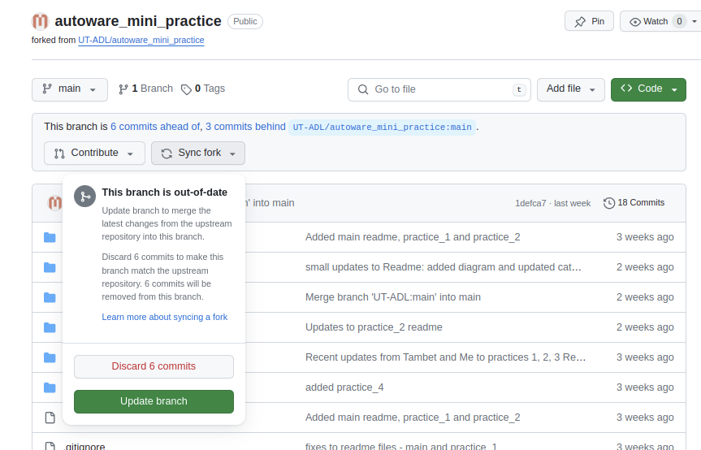

# Autoware Mini Course

This repo serves as an introduction to Autoware Mini. There are 8 practices that introduce the principles of main modules of Autoware Mini.

## Practices

| Practice | Topic                   |
|----------|-------------------------|
|    1     | [Introduction to ROS](practice_1)     |
|    2     | [Localizer](practice_2)               |
|    3     | [Controller](practice_3)              |
|    4     | [Global planner](practice_4)          |
|    5     | [Obstacle detection](practice_5)      |
|    6     | [Local planner](practice_6)           |
|    7     | [Traffic light detection](practice_7) |
|    8     | [CARLA simulator](practice_8)         |

## How to start

* Practices are organized into ROS packages: `practice_1`, `practice_2`, etc.
* To start with practices the repo should be forked to your GitHub.
* After forking the repo find the README file in [practice_1](practice_1) folder to start.
* Don't clone the repo to your computer yet! We will do it in practice_1 as part of the practice.

**Good luck and enjoy!**

## Using Git

#### GitHub account

* You should have your own [GitHub account](https://github.com/)
* You should set up the private key to make working with GitHub easier
   * [Generate private key](https://docs.github.com/en/authentication/connecting-to-github-with-ssh/generating-a-new-ssh-key-and-adding-it-to-the-ssh-agent)
   * [Copy public key to your GitHub account](https://docs.github.com/en/authentication/connecting-to-github-with-ssh/adding-a-new-ssh-key-to-your-github-account)
* When cloning the repo it is advised to use SSH link

#### Sync your GitHub repo with upstream
* You should regularily sync your fork repo with upstream repo because of updates and fixes
* The best time is to do it before starting the next practice
* You just need to press **Sync Fork** and then **Update branch**

#### Adding support for git-lfs
* Because of some large bag files we are using [git-lfs](https://git-lfs.com/) in the repo
* You need to set it up also in your repo with following commands:
   * `sudo apt install git-lfs`
   * `git lfs install` - this you need to run inside your cloned repo
* If you cloned the repo previously without having git-lfs initialized you might need to additionally first remove the bag files and then checkout them
   * `rm common/data/bags/*.bag`
   * `git checkout common/data/bags`

#### Basic git commands

* git commands you should be familiar with:
   * `git add`
   * `git commit -m "your commit message"`
   * `git push`
   * `git pull`
* We suggest regularily pushing your work into your GitHub repo.
* All the assesment of your progress will be done by reviewing your code in your GitHub repo.
