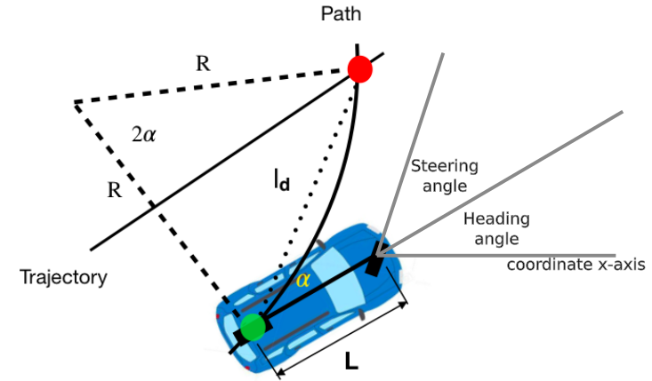

[< Previous practice](../practice_2) -- [**Main Readme**](../README.md) -- [Next practice >](../practice_4/)

# Practice 3 - Controller

In this practice, we will implement a simple path-following algorithm (controller) called Pure Pursuit. Path following is about staying on the path as accurately as possible while driving the car. We can only control the vehicle through the steering angle (lateral control) and speed (longitudinal control). Your task is implementing the Pure Pursuit algorithm that produces the steering angles to keep the car on the path. Velocities will be taken from the recorded path (result of practice 2).

Output from your node (steering angle and speed) will go into the `bicycle_simulation` node (that is provided). It will calculate and update where the vehicle will be in the next time step and its speed and orientation based on the vehicle's current position and commands from your controller node.

More about Pure Pursuit:
* [Three methods of lateral control](https://www.shuffleai.blog/blog/Three_Methods_of_Vehicle_Lateral_Control.html)
* [Pure Pursuit](https://thomasfermi.github.io/Algorithms-for-Automated-Driving/Control/PurePursuit.html)

#### Additional files provided
* The following nodes are added:
   - `waypoint_loader` - loads waypoints and publishes them as a path
   - `global_path_visualizer` - visualizes the path
   - `bicycle_simulation` - simulates the vehicle movement using a simple bicycle model
* Added configuration files
   - `planning.yaml` - some of the parameters for `waypoint_loader` are taken from that file
   - `vehicle.yaml` - necessary parameters for `bicycle_simulator`


### Expected outcome
* Understanding about the general task of the vehicle's lateral control
* The ego vehicle can follow the recorded waypoints (path) from practice_2. Theoretically, the same simple controller could be used with a real car.


## 1. Preparation

1. As a reminder, let us build the workspace. It is not necessary here since we are adding a Python node that does not need building. If we were using code in C or C++, we would need to build the workspace and source it after including the source code of the new node or after every code change.
2. Go to catkin_ws folder: `cd ~/autoware_mini_practice`
3. `catkin clean` - will clean the workspace. Removes `build` and `devel` folders. It is suggested when nodes are removed or replaced.
4. Optional: `source /opt/ros/noetic/setup.bash` - source only ROS. All other ROS packages will be unsourced. It might be necessary to do this if you already have some packages sourced in the terminal (for example, `autoware_mini`). If you do `catkin build` with `autoware_mini` sourced it will create a [chained workspace](https://wiki.ros.org/catkin/Tutorials/workspace_overlaying#Chaining_catkin_workspaces).
5. Build workspace: `catkin build`
6. Source your workspace: `source devel/setup.bash`

##### Validation
* run `roslaunch practice_3 practice_3.launch`
   - should load the waypoints (uses default file name) created in previous practice and visualize them in rviz (path with waypoints, blinker information and speed values at the waypoints)
   - if you don't have a waypoint file in your common package, you should be able to create it any time by running `roslaunch practice_2 practice_2.launch`. The assumption is that you have finilized your localizer node in practice 2.


## 2. Create a path follower node

After running `roslaunch practice_3 practice_3.launch`, we saw waypoints loaded and visualized in rviz. We can call this array of waypoints a global path, and this is what we want to follow with the car. In this task, we will create a "skeleton" of that node.

##### Instructions
1. Create node `pure_pursuit_follower.py` under `nodes/control`
2. Organize the node using the class structure - see the code example below
   - create a class `PurePursuitFollower`
   - organize the code in class init into logical groups
   - create also `if __name__ == '__main__'` block ([read about it](https://docs.python.org/3/library/__main__.html#idiomatic-usage))
   - main code in callbacks that are class methods

```
import rospy

from autoware_msgs.msg import Lane
from geometry_msgs.msg import PoseStamped

class PurePursuitFollower:
    def __init__(self):

        # Parameters

        # Publishers

        # Subscribers
        rospy.Subscriber('path', Lane, self.path_callback, queue_size=1)
        rospy.Subscriber('/localization/current_pose', PoseStamped, self.current_pose_callback, queue_size=1)

    def path_callback(self, msg):
        # TODO

    def current_pose_callback(self, msg):
        # TODO

    def run(self):
        rospy.spin()

if __name__ == '__main__':
    rospy.init_node('pure_pursuit_follower')
    node = PurePursuitFollower()
    node.run()
```

3. Two subscribers are already created. Add some content in the callbacks so that it won't give an error when you run it (`pass` or some kind of helpful printouts)
   - for example, in `current_pose_callback`, you could print out coordinates
4. Add the [shebang line](https://en.wikipedia.org/wiki/Shebang_(Unix)) and [give execution rights](https://kb.iu.edu/d/abdb) to your node
5. Modify the `practice_3.launch` file by adding the launching of the node `pure_pursuit_follower`
   - Inside the node tags, you will see [remap](https://wiki.ros.org/roslaunch/XML/remap) from topic `path` to `global_path`. It is because `waypoint_loader` is publishing its path to the topic `global_path`, but our follower subscribes to the general `path`. In this case, we add topic remap; in other use cases, the same follower node might need to subscribe to `local_path`. Then, we would add a remap to `local_path`. So, the node itself is more general and can handle both. That is why we use the more general name inside the node, and special cases are solved using remaps.

```
<!-- Waypoint follower -->
<node pkg="practice_3" type="pure_pursuit_follower.py" name="pure_pursuit_follower" output="screen" required="true" >
    <param name="lookahead_distance"  value="$(arg lookahead_distance)" />
    <remap from="path" to="global_path"/>
</node>
```

#### Validation
* run `roslaunch practice_3 practice_3.launch`
* The path should be visualized, and no error messages in the console
* If you are printing out `current_pose` see if the output is logical (starting with `x: 0.0, y: 0.0`), and when placed near to the path start, coordinates should be close to the following: `x: 266.7159118652344, y: -894.0006713867188`
* There should also be a console output message from the bicycle simulator node when setting the 2D Pose Estimate:


```
[INFO] [1705322635.856730]: /bicycle_simulation - initial position (266.188538, -893.716125, 0.000000) orientation (0.000000, 0.000000, -0.984878, 0.173251) in map frame
```

* run `rqt_graph` (`Nodes_only` option selected in the image below)
   - You should now see the running nodes, their topics (written on connecting arrows) and how they are connected. 
   - There should be a connection between the following nodes and topics: `/waypoint_loader -> /global_path -> /pure_pursuit_follower`
   - Also `/bicycle_simulator -> /localization/current_pose -> /pure_pursuit_follower`
   - And nothing goes out of the `/pure_pursuit_follower`


## 3. Create a vehicle command publisher

`pure_pursuit_follower` must send a vehicle command (contains speed and steering angle). It must be picked up by the simulator (currently `bicycle_simulator`) that will calculate where the car will end up within the next iteration (it lasts a fixed time) given the current position, speed, car orientation and the vehicle command. After doing these calculations, the simulator gives us new position, orientation and speed (In real situations, it would be the task of a localizer). New updated values go again into the `pure_pursuit_follower` to recalculate a new steering angle and speed corresponding to the updated location, orientation and speed. So, there has to be a cycle between these nodes.

We need to publish the vehicle command from the `pure_pursuit_follower`, and the `bicycle_simlator` node will subscribe to it. Vehicle command consists of two parts:
* lateral control - steering angle
* longitudinal control - speed

In this step, we will publish constant values to confirm that the ego vehicle will start to drive and that this cycle between the simulator node and the follower node works.

##### Instructions
1. Create Publisher for the vehicle command topic `/control/vehicle_cmd`, message type [autoware_msg/VehicleCmd](https://github.com/streetdrone-home/Autoware/blob/master/ros/src/msgs/autoware_msgs/msg/VehicleCmd.msg)
2. Create the message and fill in the `linear_velocity` (speed) and `steering_angle` with some constant values

```
vehicle_cmd = VehicleCmd()
vehicle_cmd.ctrl_cmd.steering_angle = 0.2
vehicle_cmd.ctrl_cmd.linear_velocity = 10.0
```
3. Publish the vehicle command message and make sure that
   - `header.stamp` takes the stamp from `/current_pose` message
   - `header.frame_id = "base_link"`
   - Depending how you named your Publisher: `self.vehicle_cmd_pub.publish(vehicle_cmd)`

##### Validation
* run `roslaunch practice_3 practice_3.launch`
* place a `2D Pose Estimate` close to the path, and the ego vehicle should drive in a circular pattern
* run `rostopic echo /control/vehicle_cmd/ctrl_cmd` to verify what commands are actually published
* run `rqt_graph` and see from the node graph that there is a circle of connections in `/pure_pursuit_follower -> /control/vehicle_cmd -> /bicycle_simulation -> /localization/current_pose -> /pure_pursuit_follower`


## 4. Implement lateral control I

We have reached a point where we are publishing the vehicle command with constant values, and the ego vehicle reacts to these commands. Now, we have to start calculating meaningful vehicle commands for the lateral control, and we will use the Pure Pursuit algorithm for that.

A small summary and code example for Pure Pursuit can be seen in [Three methods of lateral control](https://www.shuffleai.blog/blog/Three_Methods_of_Vehicle_Lateral_Control.html).

It will come down to using the formula below for the steering angle calculation:


* &#948; - steering angle
* L - wheelbase
* &#945; - the difference in car heading and lookahead point heading
* ld - lookahead point distance

Image below from: https://www.shuffleai.blog/blog/Three_Methods_of_Vehicle_Lateral_Control.html


**Important Note:** On the image you can see 2 terms, but here we use the terms differently:
* *Trajectory* - means the path we want to follow. In this practice we use term **path** to represent what is ment by the *trajectory* on the image. It might come from loading the waypoints, planning the global path (practice 4) on the map or extracting the local path from the global path.
* *Path* - can be interpreted as **actual path** the ego vehicle takes, it will not align perfectly with the path we want ego vehicle to follow. We don't refer much to the actual path in this practice, but it is important to understand that there is this misalignment between them.

The main calculation for lateral control will happen in `current_pose_callback` because whenever we get a new update for our location and orientation, we immediately want to calculate a new steering angle and speed. We need to have the path and ego vehicle location (current pose) to do the calculations.

The distance from the path start will represent the ego vehicle location on the path. We can use shapely [project](https://shapely.readthedocs.io/en/stable/reference/shapely.LineString.html#shapely.LineString.project) and [interpolate](https://shapely.readthedocs.io/en/stable/reference/shapely.LineString.html#shapely.LineString.interpolate) here:
* `project` - will return distance of the ego vehicle from path start (first projects car to the closest point on the path)
* `interpolate` - returns a shapely Point within the distance along the path


##### Instructions

1. First, we need a path in shapely Linestring format. Add the following code to the correct places:

```
from shapely.geometry import LineString, Point
from shapely import prepare, distance

# convert waypoints to shapely linestring
path_linestring = LineString([(w.pose.pose.position.x, w.pose.pose.position.y) for w in msg.waypoints])
# prepare path - creates spatial tree, making the spatial queries more efficient
prepare(path_linestring)
```

2. Create the class variable for the path in class initialization with the value `None` and assign it in the callback after it has been prepared by shapely `prepare`.
3. In the current_pose_callback, add the calculation of ego distance from the path start. We can interpret it as the relative location on the path. And it will be a reference point for our following calculations.
   - First, we convert the ego vehicle location to shapely Point.
   - Then, find the distance using the `project` function from shapely.
   - The ego vehicle itself will not be ideally on the path (path vs actual path), so this distance will represent the location on the path that is closest to the ego vehicle (closest point on path) 

```
current_pose = Point([msg.pose.position.x, msg.pose.position.y])
d_ego_from_path_start = self.path_linstring.project(current_pose)
``` 

4. Remove previous printouts and add another one printing out `d_ego_from_path_start`
5. You can test running the `practice_3.launch` and occasionally see the error in the console log (see below). It appears when the path_callback does not manage to assign value to `self.path_linestring` (you might have named it differently), and it is already being used in `current_pose_callback`. Fix it by checking if the value is not set the `current_pose_callback` should return.

```
d_ego_from_path_start = self.path_linestring.project(current_pose)
AttributeError: 'NoneType' object has no attribute 'project'
```

##### Validation

* run `roslaunch practice_3 practice_3.launch`
* place `2D Pose Estimate` and see if the printed-out distance from the path start seems logical.


## 5. Implement lateral control II

The following steps are to get the additional parameters necessary to calculate the `lookahead_point` and, finally, the steering angle.

A modified drawing with added heading angle and steering angle:



##### Instructions
1. Read in parameter values:
   - `lookahead_distance` - comes from the launch file. This parameter should be used to find lookahead point location on the path.
      - It can't be directly used as `ld` in the above image, see point 4.
   - `wheel_base` - comes from `/config/vehicle.yaml` file. Important parameter for steering angle calculation
2. Calculate the current heading angle from `current_pose.pose.orientation`. Use `euler_from_quaternion` from `tf.transformations` to get the angle.
   - `euler_from_quaternion` returns euler angles and they are in the order of roll, pitch and yaw. Yaw angle is rotation around z-axis with 0 pointing along the x-axis, so we can use this as heading. 
3. Calculate the lookahead point and then the heading; the latter can be calculated from point coordinates using the `arctan2` function.
4. Recalculate the lookahead distance - `ld`. It needs to be the direct distance between 2 points, and therefore, it will not be precisely the value of the `lookahead_distance` parameter. It can be calculated using shapley function `distance` that takes 2 Points as inputs.

```
# Reading in the parameter values
self.lookahead_distance = rospy.get_param("~lookahead_distance")
self.wheel_base = rospy.get_param("/wheel_base")

# using euler_from_quaternion to get the heading angle
from tf.transformations import euler_from_quaternion
_, _, heading = euler_from_quaternion([msg.pose.orientation.x, msg.pose.orientation.y, msg.pose.orientation.z, msg.pose.orientation.w])

# lookahead point heading calculation
lookahead_heading = np.arctan2(lookahead_point.y - current_pose.y, lookahead_point.x - current_pose.x)
```

Examples of using the `project`, `interpolate` and `distance` functions from `shapely`.

```
>>> from shapely import LineString, Point
>>> line = LineString([(0, 0), (10, 10)])
>>> point1 = Point(5, 5)
>>> point2 = Point(0, 5)

>>> line.project(point1)
7.0710678118654755
>>> line.interpolate(6)
<POINT (4.243 4.243)>
>>> shapely.distance(point1, point2)
5.0

```
5. Calculate the steering angle using the formula below and use the value to replace the `steering_angle` in vehicle command.


* &#948; - steering angle
* L - wheelbase
* &#945; - the difference in car heading and lookahead point heading
* ld - lookahead point distance


##### Validation
* run `roslaunch practice_3 practice_3.launch`
* place the car close to the path. It should start following the path and do the correct turns.
* You can experiment by placing the start point in different distances and directions from the path


## 6. Implement longitudinal control

For longitudinal control, we need to take the speed from the path. We have recorded waypoints, so each waypoint has the speed attribute, and the result should be the same speed profile as during the waypoint recording. When the path comes from the map, then the waypoints will have maximum speed limit or reference speeds (convenient driving speed at that location) from the map data.

Speed adjustment in turns (sharper turns need smaller speed) can be additionally added to the global planner or some specialized node that will smooth the speed profile for the path. Reacting to obstacles (slowing down, bringing ego vehicle to a stop) will be the task for the local planner. They both would produce a path - an array of waypoints - and thus the followers' behaviour should be the same: use waypoints for speed.

Current waypoints have 1m spacing, but you can record much sparser waypoints, or if the path comes from the map, then there can be a long distance between waypoints in a straight section. The solution is simple - we will create a function that will do linear interpolation to get a speed value based on the location of ego vehicle on the path (the same already calculated distance from path start). So, we give it a distance, and the result is speed.

##### Instructions

1. Collect waypoints into an array of x and y coordinates
2. Calculate the distances between waypoints and add the 0m distance to the beginning of the distances array (distance to first waypoint is 0)
3. Extract velocity values at the waypoints

```
from scipy.interpolate import interp1d

# Create a distance to velocity interpolator for the path
# collect waypoint x and y coordinates
waypoints_xy = np.array([(w.pose.pose.position.x, w.pose.pose.position.y) for w in msg.waypoints])
# Calculate distances between points
distances = np.cumsum(np.sqrt(np.sum(np.diff(waypoints_xy, axis=0)**2, axis=1)))
# add 0 distance in the beginning
distances = np.insert(distances, 0, 0)
# Extract velocity values at waypoints
velocities = np.array([w.twist.twist.linear.x for w in msg.waypoints])
```

4. Now you have `distances` and respective `velocities`. You are ready to create the function. We can use `interp1d` from the [scipy library](https://docs.scipy.org/doc/scipy/reference/generated/scipy.interpolate.interp1d.html#scipy.interpolate.interp1d).
   - Create the interpolator so that whenever the input distance is outside the range of the input distances, the returned value is 0.0. Use (`bounds_error` and `fill_value`)
   - When interpolator is created, we can input the distance and it returns the velocity, see example below

```
distance_to_velocity_interpolator = interp1d(distances, velocities, kind='linear')
velocity = distance_to_velocity_interpolator(d_ego_from_path_start)

```
5. When integrating the interpolator into the code:
   - Create the class variable for the interpolator that is initially assigned with the value `None`.
   - Only reassign it with the interpolator when it is ready in the callback.
   - It will also be used in `current_pose_callback` through the class variable, but it might not be initialized, so add it to a check in front of the callback

##### Validation
* run `roslaunch practice_3 practice_3.launch`
* Place the ego vehicle at the start of the path (use **2D Pose Estimate** button in rviz), and it should start following the path, and the speed should reflect the moment of recording the bag.
* If everything works without errors, clean the code (remove unnecessary debugging printouts) and commit to your repo!
* run it with different lookahead distance `roslaunch practice_3 practice_3.launch lookahead_dist:=20`
   - Is the behaviour different? What is different and why? Send the answer when all the code is finalized and committed with the email, along with the notification that the code is ready for review.
