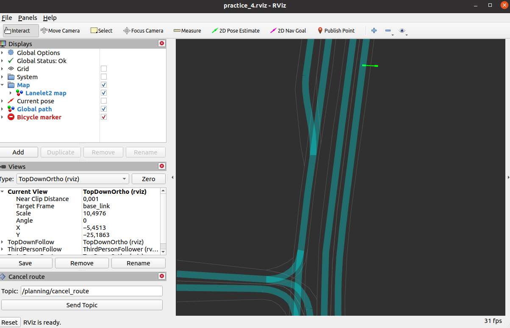

[< Previous practice](../practice_3) -- [**Main Readme**](../README.md) -- [Next practice >](../practice_5)

# Practice 4 - Global planner

In this practice, we will be using a map. Map is in [Lanelet2](https://github.com/fzi-forschungszentrum-informatik/Lanelet2) format. Your task will be to write a global planner that finds the shortest route from the vehicle's current location to the goal point. The path should then be converted to a `Lane` message so that the `pure_pursuit_follower`, a node you wrote in the previous practice, could use it for path following.

#### New in practice_4 package files
* map files `tartu_demo.osm` and `tartu_large.osm` under `common/data/maps`
* Lanelet2 map visualization node: `nodes/planning/visualization/lanelet2_map_visualizer.py`

### Expected outcome
* General level understanding of the global planner tasks
* Car can follow a path created by the global planner (from ego vehicle's current location to the selected destination on the map)


## 1. Preparations

1. Copy your `pure_pursuit_follower` node from practice_3 
2. Copy the `practice_3.launch` file under the `launch` folder and edit it
   - replace references inside the file from `practice_3` to `practice_4`
   - replace link to `practice_3.rviz` with `practice_4.rviz`
4. At the start of the launch file, add an argument `lanelet2_map_name` with a default value of `tartu_demo.osm`
5. Add the `lanelet2_map_visualizer` node to the launch file and make sure the param `lanelet2_map_name` is set for the node
6. Find in the launch file where the rosparam file `localization.yaml` is loaded and add at the end a namespace `localization`, see below:

```
<rosparam command="load" file="$(find practice_4)/config/localization.yaml" ns="localization" />
```

##### Validation
* `roslaunch practice_4 practice_4.launch lanelet2_map_name:=tartu_large.osm`
* After launching:
   - You should see the map and ego vehicle in Delta pocket
   - Ego vehicle should start driving immediately. Where does it drive?




## 2. Create a global planner node and get the goal point

This node will make it possible to plan a path on the map. So, instead of loading the path from the waypoints file, we can select any destination on the map, and the global planner will create the path from the current location to the selected goal point.

##### Instructions
1. Create a new file, `lanelet2_global_planner.py` under `nodes/planning/global`
2. When creating the node, follow the class-based structure (you can take hints from previous practice or other provided nodes)
3. Add the code for lanelet2 map loading; you can use the code from `lanelet2_map_visualizer` node as an example
   - import necessary classes from the lanelet2 library
   - read in necessary ros parameters from `localization.yaml` and `lanelet2_map_name` coming from the launch file
   - add the code that loads the [lanelet2 map](/nodes/planning/visualization/lanelet2_map_visualizer.py#L46-L57)

```
# All these imports from lanelet2 library should be sufficient
import lanelet2
from lanelet2.io import Origin, load
from lanelet2.projection import UtmProjector
from lanelet2.core import BasicPoint2d
from lanelet2.geometry import findNearest
```

4. Create a subscriber and callback to get the goal point. Goal point will be entered on the map using a button in RViz with a purple arrow: `2D Nav Goal`
   - The goal point is published to a topic: `/move_base_simple/goal`, type: `geometry_msgs/PoseStamped`
   - add [loginfo](https://wiki.ros.org/rospy_tutorials/Tutorials/Logging) message informing that the goal point has been received. 
   - It is good practice to start with the node name that creates the log and it might be useful to print out also the coordinates, for example:

```
# loginfo message about receiving the goal point
rospy.loginfo("%s - goal position (%f, %f, %f) orientation (%f, %f, %f, %f) in %s frame", rospy.get_name(),
                    msg.pose.position.x, msg.pose.position.y, msg.pose.position.z,
                    msg.pose.orientation.x, msg.pose.orientation.y, msg.pose.orientation.z,
                    msg.pose.orientation.w, msg.header.frame_id)

```

5. Edit the launch file by replacing the `waypoint_loader` node with `lanelet2_global_planner` node and make sure it gets the parameter `lanelet2_map_name`

##### Validation
* run `roslaunch practice_4 practice_4.launch`
* It should start at the same location and with the map loaded as in the previous validation, but the ego vehicle should stay stopped.
* Test also by adding the goal point - purple arrow with `2D Nav Goal` written next to it. You should have the message about receiving the goal printed out in the console.

Output loginfo messages:
```
[INFO] [1707312819.916352]: /lanelet2_global_planner - goal position (-1.027190, -40.500565, 0.000000) orientation (0.000000, 0.000000, -0.760734, 0.649064) in map frame
[INFO] [1707312907.073692]: /lanelet2_global_planner - goal position (4.622345, -35.071140, 0.000000) orientation (0.000000, 0.000000, 0.619234, 0.785206) in map frame
```

* run `rqt_graph` - your node graph should look similar:


## 3. Find the route on the lanelet2 map

Next, we will implement the logic of creating the global plan (path from start to goal point). We need the current pose and goal point to be available.

To find a route with lanelet2 library traffic rules object and routing graph needs to be created first - [see example here](https://github.com/fzi-forschungszentrum-informatik/Lanelet2/blob/master/lanelet2_examples/scripts/tutorial.py#L215). For more thorough overview about [lanelet2 routing](https://github.com/fzi-forschungszentrum-informatik/Lanelet2/tree/master/lanelet2_routing). 

The following code can be used to create necessary objects for routing:

```
# traffic rules
traffic_rules = lanelet2.traffic_rules.create(lanelet2.traffic_rules.Locations.Germany,
                                          lanelet2.traffic_rules.Participants.VehicleTaxi)
# routing graph
self.graph = lanelet2.routing.RoutingGraph(self.lanelet2_map, traffic_rules)
```

##### Instructions
1. Generate traffic rules and routing graph
2. Create the subscriber to the `/localization/current_pose` message, type: `geometry_msgs/PoseStamped`
3. Convert current_pose and goal point to lanelet2 geometry type of `BasicPoint2d`

```
self.current_location = BasicPoint2d(msg.pose.position.x, msg.pose.position.y)
```

4. `findNearest()` from lanelet2.geometry can be used to find lanelets closest to points (current pose or goal); see code below.
5. `getRoute()`, `shortestPath()` and `getRemainingLane()` from lanelet2 python api routing part will be useful.

```
# get start and end lanelets
start_lanelet = findNearest(self.lanelet2_map.laneletLayer, self.current_location, 1)[0][1]
goal_lanelet = findNearest(self.lanelet2_map.laneletLayer, self.goal_point, 1)[0][1]
# find routing graph
route = self.graph.getRoute(start_lanelet, goal_lanelet, 0, True)

# find shortest path
path = route.shortestPath()
# this returns LaneletSequence to a point where lane change would be necessary to continue
path_no_lane_change = path.getRemainingLane(start_lanelet)
```

6. If no route has been found after entering the goal point return None and add a warning message `logwarn`
7. Add a printout for the `path_no_lane_change`

##### Validation
* run `roslaunch practice_4 practice_4.launch`
* Try to add a goal point where it is impossible to reach and see your warning message in the console
* Place a goal point near the ego vehicle start location, and if the route has been found, a LaneletSequence should be printed out in the console. See example below:

```
LaneletSequence([ConstLanelet(403, ConstLineString3d(5005287, [ConstPoint3d(10001311, 2.94416, 11.6655, 34.53), ConstPoint3d(10018228, 2.2844, 8.62274, 34.5425), ConstPoint3d(10018229, 1.64092, 4.13419, 34.52), ConstPoint3d(10001314, 0.680376, -2.76998, 34.4925)], AttributeMap({'type': 'virtual'})), ConstLineString3d(5008181, [ConstPoint3d(10001313, -0.469599, 12.4217, 34.7094), ConstPoint3d(10035882, -0.493074, 12.2516, 34.7094), ConstPoint3d(10035883, -1.72435, 3.33124, 34.58), ConstPoint3d(10001316, -2.52863, -2.32171, 34.5919)], AttributeMap({'type': 'curbstone'})), AttributeMap({'location': 'urban', 'one_way': 'yes', 'speed_limit ': '50', 'speed_ref': '14', 'subtype': 'road', 'turn_direction': 'straight', 'type': 'lanelet'})), ConstLanelet(635, ConstLineString3d(5006813, [ConstPoint3d(10001314, 0.680376, -2.76998, 34.4925), ConstPoint3d(10030250, 0.585444, -4.42386, 34.4906), ConstPoint3d(10030251, 0.670187, -6.25323, 34.4675), ConstPoint3d(10030252, 0.882086, -7.93378, 34.4056), ConstPoint3d(10030253, 1.50244, -11.5438, 34.3812), ConstPoint3d(10030254, 1.9042, -13.8817, 34.3638), ConstPoint3d(10030255, 2.16653, -15.6485, 34.3481), ConstPoint3d(10030256, 2.32317, -18.046, 34.3662), ConstPoint3d(10030257, 2.32041, -20.4684, 34.3575), ConstPoint3d(10001300, 2.39995, -20.656, 34.3575)], AttributeMap({'type': 'virtual'})), ConstLineString3d(5008182, [ConstPoint3d(10001316, -2.52863, -2.32171, 34.5919), ConstPoint3d(10035884, -2.64504, -3.13996, 34.5913), ConstPoint3d(10035885, -2.65793, -3.23052, 34.5913), ConstPoint3d(10035886, -2.9109, -5.6337, 34.5744), ConstPoint3d(10035887, -2.5264, -10.0436, 34.57), ConstPoint3d(10035888, -1.69238, -18.0843, 34.4), ConstPoint3d(10001302, -1.32892, -20.1109, 34.4162)], AttributeMap({'type': 'curbstone'})), AttributeMap({'location': 'urban', 'one_way': 'yes', 'speed_limit ': '50', 'speed_ref': '22', 'subtype': 'road', 'turn_direction': 'left', 'type': 'lanelet'}))])

```


## 4. Convert lanelets to a path

We now have a route (`path_no_lane_change` from code example) that consists of lanelets (LaneletSequence), but we need to convert it to message type `autoware_msgs/Lane` and publish it to a topic `global_path`, so the `pure_pursuit_follower` would be able to subscribe to it and do its job (path following).

##### Instructions
1. Create a separate function that converts lanelet sequence to waypoints
2. Previously acquired LaneletSequence (`path_no_lane_change`) is iterable, so use for loop to go over it and get the individual lanelets
3. Check if lanelets have the attribute `speed_ref`; if yes, use it for waypoint speed.
   - `speed_ref` is in **km/h**, but Waypoint message needs it in  **m/s**
   - Add a parameter `speed_limit` to a launch file with a default value of 40km/h. None of the waypoint speeds in the path should exceed it!
   - If lanelet does not have the `speed_ref`, then `speed_limit` should be used for its waypoints.

```
# code to check if lanelet has attribute speed_ref
if 'speed_ref' in lanelet.attributes:
    speed = float(lanelet.attributes['speed_ref'])
```

4. [Waypoints](https://github.com/streetdrone-home/Autoware/blob/master/ros/src/msgs/autoware_msgs/msg/Waypoint.msg) should be extracted from `lanelet.centerline` (again it is iterable and gives you points where coordinates can be accessed with point.x, point.y etc.).
hint: the end point of a lanelet and the start point of the following lanelet overlap - there should be no overlapping waypoints in the output path

```
# create Waypoint and get the coordinats from lanelet.centerline points
waypoint = Waypoint()
waypoint.pose.pose.position.x = point.x
waypoint.pose.pose.position.y = point.y
waypoint.pose.pose.position.z = point.z
waypoint.twist.twist.linear.x = speed
```

5. Create a publisher and publish waypoints into the topic `global_path`; it should be [latched topic](https://wiki.ros.org/rospy/Overview/Publishers%20and%20Subscribers#rospy.Publisher_initialization). 
   - create a special function for waypoint publishing that is called within the callback (after the lanelet sequence has been converted to waypoints). It makes the code more modular and has a better overview, and we might need to call it from another callback, as we will see later.
   - `global_path` should be type [autoware_msgs/Lane](https://github.com/streetdrone-home/Autoware/blob/master/ros/src/msgs/autoware_msgs/msg/Lane.msg) and its attribute `waypoints` is the list of Waypoints.
   - `frame_id` should come from `config/planning.yaml` file, parameter `output_frame`
   - timestamp should be added

```
lane = Lane()        
lane.header.frame_id = self.output_frame
lane.header.stamp = rospy.Time.now()
lane.waypoints = waypoints
self.waypoints_pub.publish(lane)
```

##### Validation
* run `roslaunch practice_4 practice_4.launch lanelet2_map_name:=tartu_large.osm`
* Everything should run without errors.
* run `rqt_graph`; nodes should be now connected like this:


* run `roslaunch practice_4 practice_4.launch lanelet2_map_name:=tartu_large.osm` with additional argument of `speed_limit:=10`. Verify that the planned route does not exceed the specified velocity. You can echo the `/localization/current_velocity` topic.
* See what happens when the ego vehicle reaches the end of the path.


## 5. Clear the path when the goal has been reached

As we saw at the end of the previous task, the ego vehicle continued to drive with some chaotic behaviour after reaching the end of the path. Additionally, the path is kept although we have reached the destination. In this task, you should add functionality that will clear the path (publish empty path) once the destination has been reached.

Publishing an empty path will cause problems for the follower, so you will need to update it.

##### Instructions

1. There is a parameter in planning.yaml called `distance_to_goal_limit` - add getting it to the node.
2. Use it to clear the path (publish empty path - empty list of waypoints) when the car is within that distance of the goal point.
   - Choose the correct callback to place it.
   - Assumes that the goal point is stored
3. Add a loginfo message that the goal has been reached when it happens and the path has been cleared.
4. run `roslaunch practice_4 practice_4.launch lanelet2_map_name:=tartu_large.osm` - see what happens when the goal has been reached - observe the console output.
   - Something goes wrong in the pure_pursuit_follower!
   - It seems that it can not handle receiving an empty path message
   - Try to understand what happens!
5. Fix the problem in `pure_pursuit_follower`
   - when empty path is received you need to stop the car and the only option is to use `vehicle_cmd`
   - what should be published to the vehicle_cmd that will make a vehicle come to a stop?


##### Validation
* run `roslaunch practice_4 practice_4.launch lanelet2_map_name:=tartu_large.osm`
* Everything should run without errors.
* When the car approaches the end of the path, there should be a log info message (goal reached) and the path should be cleared, and the vehicle should gradually come to a complete stop. It can't stop immediately because there are deceleration limits in the `bicycle_simulator`, so it will still drive past the goal point. Stopping at the correct place just before the path ends will be solved in the local planner.


## 6. One more thing

Most probably you have noticed that the path end and goal point are not in sync. The problem starts when we use `findNearest()` to get the closest lanelet to the goal point, it returns the whole lanelet, and if the goal point is somewhere in the middle of the lanelet, then that is where the discrepancy comes from. 

The following example illustrates the issue:
* run: `roslaunch practice_4 practice_4.launch lanelet2_map_name:=tartu_large.osm`
   - set the start location
   - set the goal point
   - Observe how the path is drawn and when it is cleared


* We want to have the path end and goal point in the exact same location, because
   - later, when the local planner takes care of stopping at the path end, it does not have the information about the user-selected goal point, so for the local planner the goal point is at the end of the path (last waypoint)
   - The global planner knows the goal point entered by the user and uses this for path end check. And that is the source of confusion.

This needs to be solved - we need to sync them. 

##### Instructions

Find your solution to the problem. The solution is valid if the last waypoint of the path and the goal point are aligned (are in the same location). This means that you might need to alter the goal point or path endpoint locations (coordinates).

Three ideas that might help:
1. The most straightforward solution is to accept that a full lanelet is added to the path and use the last waypoint from there to overwrite the goal point.
2. Use the closest waypoint to a goal point as the path end and use that also for resetting the goal point location.
3. Create a new waypoint - the closest point on the path to the user-selected goal point (shapely project and interpolate can be used) and use that as the path end and goal point.


##### Validation
* Test your solution and verify that it works!
* Clean the code, add comments, think about the readability of the code and pay attention to formatting
* Commit your code!
* When finished, please email small description of your solution to the last task. Then, we know that your code is ready for review.