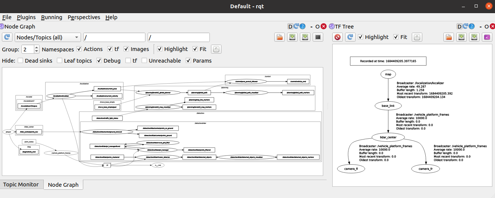
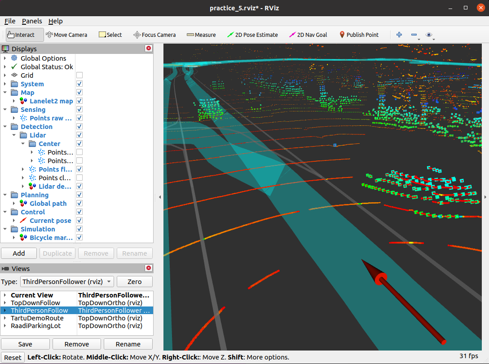
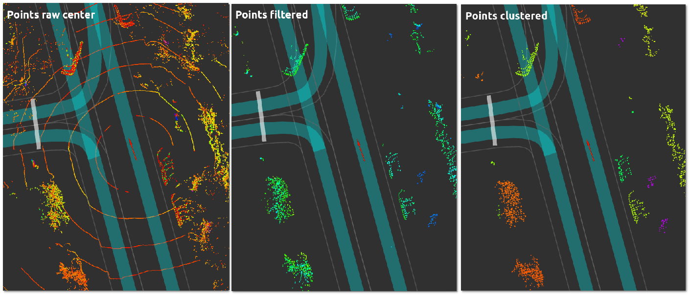
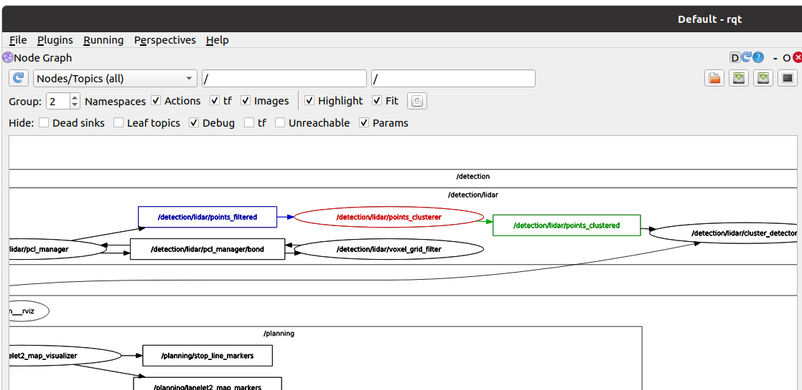
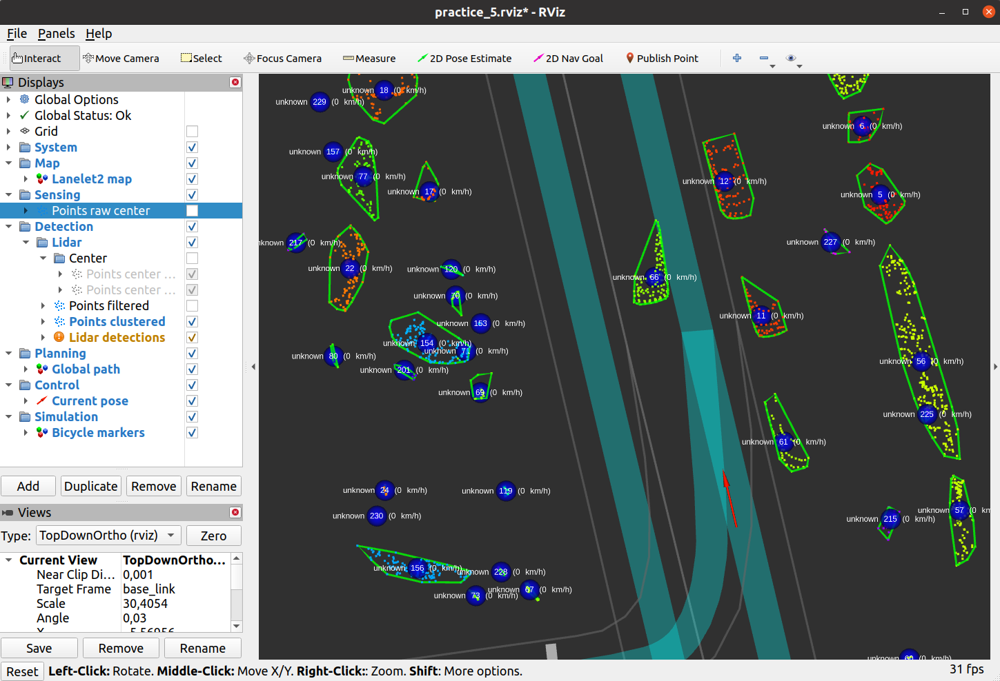

[< Previous practice](../practice_4) -- [**Main Readme**](../README.md) -- [Next practice >](../practice_6)

# Practice 5 - Obstacle detection

In this practice, we are going to use a Rosbag file with three topics in it:
* raw point cloud (`/lidar_center/points_raw`)
* GNSS log (`/novatel/oem7/inspva`)
* vehicle_cmd during the recording (`/bag/vehicle_cmd`)

After launching the `practice_5.launch` later, all other topics will come from your and other provided nodes. Your localizer will give the location on the map and publish the transform. The global planner will plan the path that is used by the follower. We will see the actions in vehicle_cmd that our stack would send to the car. These commands could be compared with the actual commands during the driving (provided in the bag), and this is one way to see how the code changes would influence the outcome.

This practice focuses on obstacle detection. The raw lidar point cloud is taken from the rosbag; the ground removal node classifies it into `points_ground` and `points_no_ground` topics. After that, a `voxel_grid_filter`  will downsample points and produce a topic `/detection/lidar/points_filtered`. Your task is to take points in this topic and transform them to [`autoware_msg/DetectedObject`](https://github.com/autowarefoundation/autoware_ai_messages/blob/master/autoware_msgs/msg/DetectedObject.msg), so that these objects could be used in local planning (reacting to obstacles).

To do that, You have to finalize two nodes:
* `points_clusterer.py` - creates `sensor_msgs/PointCloud2` message with clustered points so that the message type will remain the same as in input.
* `cluster_detector.py` - converts clustered point cloud to [`autoware_msg/DetectedObjectArray`](https://github.com/autowarefoundation/autoware_ai_messages/blob/master/autoware_msgs/msg/DetectedObjectArray.msg) that contains detected objects. The file itself with an empty callback is given.


#### Additional files
* `common/data/bags/2023-05-18-14-26-36_sensors_tfl_bot_aed_with_set_dest.bag` - rosbag file with necessary topics 
* `practice_5/nodes/detection/lidar_cluster/ground_removal.py` - node performing the ground removal
* `practice_5/nodes/detection/visualization/detected_objects_visualizer.py` - visualize detected objects in the rviz
* `practice_5/config/platform.urdf` - provides static transforms between the sensors. The file itself is loaded in the `practice_5.launch` file.
* Launch file and config files
   - `practice_5.launch` - main launch file that includes all the others
   - the other launch files are named according to the modules and included in the main launch file
   - config files under the `config` directory

### Expected outcome
* Understanding of the algorithmic and modular approach to obstacle detection
* Pointcloud from lidar scan is transformed to clusters and detected object polygons
* These detected objects can be used in the next step (local planner) for ego vehicle longitudinal control (controlling the speed of ego vehicle)


## 1. Preparation

1. Copy to practice 5 your previously created nodes 
   - `localizer` from `practice 2`,
   - `pure_pursuit_follower`, `lanelet2_global_planner` from `practice_4`
2. run `roslaunch practice_5 practice_5.launch`
   - there will be an error stating that the `/loclization/localizer` node died.
   - a bit above in the console, among others, there should be an error message `KeyError: '/undulation'`
   - when we wrote a localizer node (practice 2), the package was much simpler, and we didn't use the namespaces. Now it has grown bigger, and there is no parameter `/undulation`, but there is a parameter `/localization/undulation` that has the namespace `localization`. The `localizer` node is also run under the same namespace. So, you need to change how the parameter values are [resolved](http://wiki.ros.org/Names#Resolving) in the localizer node. This topic was touched also in practice 2.
   - make the parameter names **relative** for all three parameters in the localizer node.
3. run `roslaunch practice_5 practice_5.launch`
   - there should be no errors in the console
   - visualization in rviz should show a red arrow (location of current_pose), lanelet2 map, and lidar point cloud around the current pose
   - You should be able to set the goal point (note your log message about receiving the goal). Hint: if you hit space in the console window where you launched `practice_5.launch`, the rosbag play goes into a pause, and it might be easier to set the goal point.
   - If the ego vehicle reaches the goal point, the path should be cleared, and the information message should be displayed.
4. run `roslaunch practice_5 practice_5.launch use_detection:=true`
   - the same functionality as previously, but... 
   - an error message should be in the console saying that `points_clusterer` node was not found (we will create the node in task 2)
   - run `rqt` and explore the node graph (switch to `Nodes/Topics (all)`) - see how nodes and topics are connected.
      - Start from `/player`. It publishes `/lidar_center/points_raw` that goes to ground removal, and it publishes two topics: `points_no_ground` and `points_ground`, but nothing is using these - that is where your node should follow
      - Find `cluster_detector` node and with `rosnode info`, find the topic it is publishing and echo it. Is it empty, or is it even published?
   - In rqt, add from the menu `Plugins/Visualization/TF Tree` - you should see available frames (map, base_link_lidar_center, ...) and how they are connected. Arrows connecting the frames represent the transforms; you can see what is publishing it next to them.

   

5. While still `roslaunch practice_5 practice_5.launch use_detection:=true` running investigate more closely the rviz visualizations
   - It might be helpful at some point to stop the playback of the rosbag - press space in the console where the `practice_5.launch` was launched
   - Change Views from TopDownFollow to ThirdPersonFollow to better compare different stages in the point cloud processing
   - On the left, you can switch off and on some of the visualizations. Take your time to visualize and investigate:
      - Sensing / Points raw center - all points from the lidar scan
      - Detection / Lidar / Center / Points center ground and no ground - results from ground removal
      - You can compare points no ground and Points filtered to get an idea of how VoxelFilter changes the points
   - There should be nothing under Points clustered (task 2) and Lidar detections (task 3), but these should be there at the end of this practice




## 2. Create points_clusterer node

Let's start by getting the message data in the callback and adding a simple printout to verify that we are on the correct path.

##### Instructions
1. Create the node file `nodes/detection/lidar_cluster/points_clusterer.py` and create the typical class-based structure (you can use other existing nodes as examples)
2. Create a subscriber and the callbck to get the points
   - subscriber code: `rospy.Subscriber('points_filtered', PointCloud2, self.points_callback, queue_size=1, buff_size=2**24, tcp_nodelay=True)`, explanations:
      - `queue_size=1` - queues are processed in the FIFO (First In First Out) principle. So, by setting it to `1`, we guarantee that there is always the latest message available and the messages are not queuing up. More about it [here](https://wiki.ros.org/rospy/Overview/Publishers%20and%20Subscribers#Publishing_to_a_topic).
      - `buff_size=2**24` - increases the buffer size to ensure that the full message could be read at once
   - Message type `PointCloud2` should come from [`sensor_msgs`](https://docs.ros.org/en/melodic/api/sensor_msgs/html/msg/PointCloud2.html)
   - create the callback
3. Inside the callback, you should process the message as follows:
   - `data = numpify(msg)` - comes from [`ros_numpy`](https://github.com/eric-wieser/ros_numpy) library and provides tools for converting ROS messages to and from numpy arrays.
   - `points = structured_to_unstructured(data[['x', 'y', 'z']], dtype=np.float32)` - this will convert structured Numpy arry to unstructured - [read more here](https://numpy.org/doc/stable/user/basics.rec.html).
   - For the previous commands, you must add the following to imports (`msgify` and `unstructured_to_structured` will be used later).

   ```
   from numpy.lib.recfunctions import structured_to_unstructured, unstructured_to_structured
   from ros_numpy import numpify, msgify
   ```
4. Add printing the shape for points.


##### Validation
* run `roslaunch practice_5 practice_5.launch use_detection:=true`
* First lines printed out with shape should be similar to this - the first number should not match exactly:

```
points shape: (7114, 3)
points shape: (7065, 3)
points shape: (7214, 3)
points shape: (7119, 3)
points shape: (7104, 3)
points shape: (7065, 3)
...
```


## 3. Add clustering

At the end of the previous step, we have prepared `points` for clustering. Every point has `x`, `y` and `z` coordinates, and there are more than 7000 points to be clustered. As a reminder, these points are not ground points and are filtered by VoxelFilter. Now, we need to cluster them.

We suggest using the DBSCAN algorithm, which is available from scikit-learn library: https://scikit-learn.org/stable/modules/clustering.html#dbscan


##### Instructions:
1. There are two parameters you need to get and use for the DBSCAN algorithm from `detection.yaml` file
   - parameters are [`cluster_epsilon` and `cluster_min_size`](config/detection.yaml#L23-L24) 
   - read in these private parameters (they are under the node name in yaml file, so `~` should be used inside the node in `get_param` to get these parameter values - [ROS name resolution](http://wiki.ros.org/Names#Resolving) 
   - **do not add the default value** then it will throw an error if it can't get the parameter value, and the node will exit, making it easier to spot the problem
2. Import the clustering library and create the `self.clusterer` object using the dbscan algorithm in the class init and use the parameters 
3. Do the clustering by using the `fit_predict()` method of DBSCAN.
   - It will return the label for the points (each cluster has its own label)
   - add printing out the shape for the labels
4. Let's also add an assert here that checks if there is the same number of points and labels. If not AssertionError with the message should be raised.

##### Validation
* run `roslaunch practice_5 practice_5.launch use_detection:=true`
* Verify that the number of labels (there should be a label for each point) matches the number of points:

```
points shape: (7035, 3)
labels shape: (7035,)
points shape: (7053, 3)
labels shape: (7053,)
points shape: (7097, 3)
labels shape: (7097,)
points shape: (7119, 3)
labels shape: (7119,)
...
```


## 4. Putting together points and clusters, publish results

Now, we have an array of points and an array of labels for each point. Labels contain also a value of `-1`. This value represents noise points not assigned to any cluster because they are too sparse in space and away from other points. `points`  should be merged with `labels`, and noise points should be filtered out. From there on, it is just publishing them as PointCloud2 messages, that will serve as input to the `cluster_detector` node.

We want to publish the clustered point cloud so we can later analyze or debug the results of that node. If we would create one big node that would do the ground removal, cluster no ground points to different objects, calculate the convex hull, and just at the very end publish the final objects, then it would be very hard to find a problem if something is wrong with obstacle detection. Keeping code modular and easy to debug is why we try to create small specialized nodes in ROS.

##### Instructions
1. Concatenate points with labels and filter out noise points (label value `-1`). Hint: Previous shape printouts can be useful for figuring out how to stack and reshape them in order to put them together.
2. Now we need to create a message from the array (opposite to what we did in the task 2.3)
   ```
   # convert labelled points to PointCloud2 format
   data = unstructured_to_structured(points_labeled, dtype=np.dtype([
      ('x', np.float32),
      ('y', np.float32),
      ('z', np.float32),
      ('label', np.int32)
   ]))

   # publish clustered points message
   cluster_msg = msgify(PointCloud2, data)
   ```
3. Add to the `cluster_msg.header` a `stamp` and `frame_id`. These should be taken from the incoming message.
4. Create a publisher for topic `points_clustered`
   - add params: `queue_size=1, tcp_nodelay=True` to the publisher.
   - the publisher should be created before the subscriber. Otherwise, a subscriber might receive the data, and if the publisher is called from the callback, it might not be created yet, and we will have an error
5. Add publishing the `cluster_msg` at the end of the callback
6. Remove the previous printouts with the shapes


###### Validation
* Run `roslaunch practice_5 practice_5.launch use_detection:=true`
* There should be no errors when launched 
* Run `rostopic hz /detection/lidar/points_clustered` - the average rate should be close to 10Hz
* Examine in rviz the `Points clustered` output (switch it on and hide others) - does it seem logical (clusters should be displayed with different colors)?



* Run also `rqt_graph` and see that your node is connected to neighbouring nodes




## 5. Get data in `cluser_detector` node

**Now we will switch to `cluster_detector` node.**

This node takes in clustered points from `points_clusterer` node and converts them into [`autoware_msg/DetectedObject`](https://github.com/autowarefoundation/autoware_ai_messages/blob/master/autoware_msgs/msg/DetectedObject.msg) and publishes as the [`autoware_msg/DetectedObjectArray`](https://github.com/autowarefoundation/autoware_ai_messages/blob/master/autoware_msgs/msg/DetectedObjectArray.msg) in `detected_objects` topic.

The node itself is given, and you are tasked to implement the contents in the `cluster_callback`.


##### Instructions
1. Numpify message in the callback, and save it to `data`
2. Convert `data` to ndarray called `points` with `dtype=np.float32`; use `structured_to_unstructured` as in the example above.
   - add a printout in the code that prints out the shape of the `points` array and the first line for later validation (points before the transform)
3. As a next step, you should verify if the message `frame_id` is not equal to `output_frame` (parameter) then it needs to be done. Basically, we want to transform all the objects to a `map` frame to apply tracking in a common frame.
   - check the frames
   - if necessary, fetch the transform - already existing `self.tf_listener = TransformListener(self.tf_buffer)` should be used
   - wrap it in `try...except` block, and if the error is thrown `logwarn` should be printed out and a callback should return
   - transform `timeout` parameter should also be considered

   ```
   # fetch transform for target frame
   try:
      transform = self.tf_buffer.lookup_transform(self.output_frame, msg.header.frame_id, msg.header.stamp, rospy.Duration(self.transform_timeout))
   except (TransformException, rospy.ROSTimeMovedBackwardsException) as e:
      rospy.logwarn("%s - %s", rospy.get_name(), e)
      return
   ```
4. To transform the `points`, the following steps are done
   - transform matrix is numpified and transposed (to match them in the `points` array)
   - `points` are turned into homogeneous coordinates
   - dot product is used to transform the coordinates into needed `output_frame`
   - add again printouts in the code:
      - print `tf_matrix`, `points` shape after the transform and the first line from `points` array

   ```
   tf_matrix = numpify(transform.transform).astype(np.float32)
   # make copy of points
   points = points.copy()
   # turn into homogeneous coordinates
   points[:,3] = 1
   # transform points to target frame
   points = points.dot(tf_matrix.T)
   ```

##### Validation
* Run `roslaunch practice_5 practice_5.launch use_detection:=true`
* There should be no errors when launched
* Depending on how you formatted your printouts, something similar should appear. These are the printouts for the first 2 iterations from the rosbag data within `cluster_callback`

   ```
   -----------------cluster_callback-----------------
   points_shape before transform: (6724, 4)
   first row:  [-19.07965    -2.2886722  -1.7938206   0.       ]
   tf_matrix: 
   [[-2.0159826e-01  9.7946823e-01 -3.4906590e-04  0.0000000e+00]
   [-9.7906017e-01 -2.0152453e-01 -2.8793948e-02  0.0000000e+00]
   [-2.8273102e-02 -5.4630530e-03  9.9958533e-01  0.0000000e+00]
   [-1.0547197e+02 -4.0246555e+02  3.6827660e+01  1.0000000e+00]]
   points shape after transform:  (6724, 4)
   first row:  [ -99.33408  -420.68243    35.107143    1.      ]
   -----------------cluster_callback-----------------
   points_shape before transform: (6741, 4)
   first row:  [-19.253834   -2.4698925  -1.8120376   0.       ]
   tf_matrix: 
   [[-2.0159858e-01  9.7946817e-01 -3.4906590e-04  0.0000000e+00]
   [-9.7906005e-01 -2.0152485e-01 -2.8793948e-02  0.0000000e+00]
   [-2.8273100e-02 -5.4630628e-03  9.9958533e-01  0.0000000e+00]
   [-1.0547198e+02 -4.0246545e+02  3.6827679e+01  1.0000000e+00]]
   points shape after transform:  (6741, 4)
   first row:  [ -99.121025 -420.8163     35.09423     1.      ]
   ```


## 6. Create detected objects and publish 

In this step, we need to create the detected objects. We suggest iterating over the label values. Labels coming from DBSCAN start from 0 and increment by 1. So, the `labels` can be used to determine how many objects there are. It might be that there are no objects at all.

`labels` (array of labels for each point) can be used to create a binary mask and select only the points belonging to a specific object from `points`, for example:

```
# create mask
mask = (labels == i)
# select points for one object from an array using a mask
# rows are selected using a binary mask and only first 3 columns are selected: x, y and z coordinates
points3d = points[mask,:3]
```

Additionally, for each object, we should:
* skip all the clusters that have fewer points than parameter `min_cluster_size`
* calculate `centroid` - the mean of all the coordinates for that object
* calculate `convex_hull` - cluster borders in 2d space, using only x and y coordinates.

##### Instructions
1. Remove all previous printouts
2. Prepare [header](https://docs.ros.org/en/noetic/api/std_msgs/html/msg/Header.html) - will be identical for each object and for the general message - detected object array
   - `stamp` should be taken from the incoming message header
   - `frame_id` should be the `output_frame` parameter
3. Verify that there are objects (clusters) present, if there are no objects, then empty detected object array should be published
4. Loop over objects (clusters)
   - check if it has enough points; otherwise, skip this object
   - calculate the centroid for each object (mean of points coordinates) - the result should be written to `DetectedObject.pose.position.x`, `DetectedObject.pose.position.y` and `DetectedObject.pose.position.z`
   - calculate convex_hull for each object (see code below) - the result should be written to `DetectedObject.convex_hull.polygon.points`:
      - use only x and y coordinates, and create a shapely MultiPoint that has a function convex_hull (returns shapely polygon)
      - convert polygon to list of [`geometry_msg/Point32`](https://docs.ros.org/en/melodic/api/geometry_msgs/html/msg/Point32.html) and use centroids z coordinate for all polygon points

   ```
   # create convex hull
   points_2d = MultiPoint(points[mask,:2])
   hull = points_2d.convex_hull
   convex_hull_points = [Point32(x, y, centroid_z) for x, y in hull.exterior.coords]
   ```

5. Additionally, inside the loop, if you create the instance of `DetectedObject`, then
   - use cluster label for `id`
   - also set the following values (in the following example `object = DetectedObject()`):

   ```
   object.label = "unknown"
   object.color = BLUE80P
   object.valid = True
   object.space_frame = self.output_frame
   object.pose_reliable = True
   object.velocity_reliable = False
   object.acceleration_reliable = False
   ```

6. Publisher is already created. Use it to publish all the detected objects


##### Validation
* run `roslaunch practice_5 practice_5.launch use_detection:=true`
* There should be no errors when launching
* When `Lidar detections` are ticked, you should see the following visualization:
   - Blue centroids
   - Cluster borders for each object
   - Label `unknown` with the object id and the speed. Since there is no tracking, all the speeds are currently 0.
* Clean the code and push it to your repo. When done, please send an email stating that you are ready for code review.




## Extra information about DBSCAN

In this tutorial, we used scikit learn implementation for the DBSCAN algorithm, but there are other and faster implementations available
* cuml library: https://docs.rapids.ai/api/cuml/stable/api/#dbscan - uses GPU processing and should be fastest.
* Intel(R) Extension for Scikit-learn: https://intel.github.io/scikit-learn-intelex/latest/index.html

