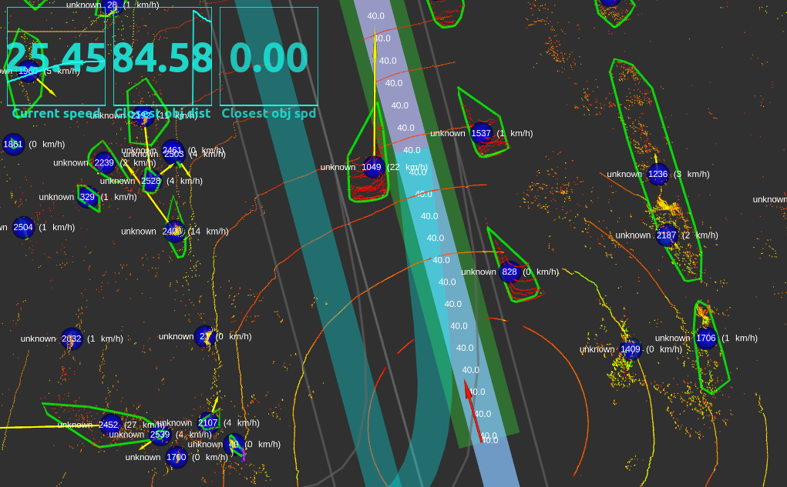

[< Previous practice](../practice_5) -- [**Main Readme**](../README.md) -- [Next practice >](../practice_7)

# Practice 6 - Local planning

In this exercise, you will create a local planning node that focuses on extracting a local path from a global path. The extracted path will be used to identify any obstacles along the way, and the node will respond to obstacles by safely decreasing the speed of the ego vehicle. If necessary, the vehicle will come to a complete stop or follow another vehicle within a safe distance. To achieve this, the node will regulate the speed of the ego vehicle by calculating a suitable target velocity whenever new information about the obstacles is received. This process is also known as longitudinal control, which is responsible for controlling the speed of an ego vehicle.

For this exercise, the local planner will not receive any lateral control tasks, such as swerving around an obstacle or planning a lane change. Lateral control, which is needed for following a pre-planned path, will remain the follower's responsibility. Throughout this exercise, the local planner node will only control speed.

#### Additionally provided:
* Tracking node - will produce speeds to obstacles
* Dashboard graphics in RViz view with some information
* Launch files with options to launch a bag file or simulation
* Obstacle simulation node that allows creating the static obstacles in the simulation mode


### Expected outcome
* Understanding of how the ego vehicle reacts to the obstacles (combination of distance and speed) - obstacle-causing minimum target speed will dictate the ego vehicle speed.
* The local planner will take over the ego vehicle's longitudinal (speed) control by reacting to the obstacles and goal points and writing the target velocity to the local path. The follower will just take it from there and use it as is.


## 1. Preparation

1. Copy to practice 6 your previously created nodes
   - They should be all available in practice 5: `localizer`, `pure_pursuit_follower`, `lanelet2_global_planner`, `points_clusterer` and `cluster_detector`
   - One way to conveniently copy them is to copy the whole nodes folder from practice 5 and paste it to practice 6 and then skip the existing files when asked. All the missing files (your nodes) would be copied.
2. Create a new file, `simple_local_planner.py` under `nodes/planning/local`
3. copy the following code:

    ```
    import rospy
    import math
    import threading
    from tf2_ros import Buffer, TransformListener, TransformException
    import numpy as np
    from autoware_msgs.msg import Lane, DetectedObjectArray, Waypoint
    from geometry_msgs.msg import PoseStamped, TwistStamped, Vector3, Vector3Stamped
    from shapely.geometry import LineString, Point, Polygon
    from shapely import prepare
    from tf2_geometry_msgs import do_transform_vector3
    from scipy.interpolate import interp1d
    from numpy.lib.recfunctions import unstructured_to_structured

    class SimpleLocalPlanner:

        def __init__(self):

            # Parameters
            self.output_frame = rospy.get_param("~output_frame")
            self.local_path_length = rospy.get_param("~local_path_length")
            self.transform_timeout = rospy.get_param("~transform_timeout")
            self.braking_safety_distance_obstacle = rospy.get_param("~braking_safety_distance_obstacle")
            self.braking_safety_distance_goal = rospy.get_param("~braking_safety_distance_goal")
            self.braking_reaction_time = rospy.get_param("braking_reaction_time")
            self.stopping_lateral_distance = rospy.get_param("stopping_lateral_distance")
            self.current_pose_to_car_front = rospy.get_param("current_pose_to_car_front")
            self.default_deceleration = rospy.get_param("default_deceleration")

            # Variables
            self.lock = threading.Lock()
            self.global_path_linestring = None
            self.global_path_distances = None
            self.distance_to_velocity_interpolator = None
            self.current_speed = None
            self.current_position = None
            self.tf_buffer = Buffer()
            self.tf_listener = TransformListener(self.tf_buffer)

            # Publishers
            self.local_path_pub = rospy.Publisher('local_path', Lane, queue_size=1, tcp_nodelay=True)

            # Subscribers
            rospy.Subscriber('global_path', Lane, self.path_callback, queue_size=None, tcp_nodelay=True)
            rospy.Subscriber('/localization/current_pose', PoseStamped, self.current_pose_callback, queue_size=1, tcp_nodelay=True)
            rospy.Subscriber('/localization/current_velocity', TwistStamped, self.current_velocity_callback, queue_size=1, tcp_nodelay=True)
            rospy.Subscriber('/detection/final_objects', DetectedObjectArray, self.detected_objects_callback, queue_size=1, buff_size=2**20, tcp_nodelay=True)


        def path_callback(self, msg):

            if len(msg.waypoints) == 0:
                global_path_linestring = None
                global_path_distances = None
                distance_to_velocity_interpolator = None
                rospy.loginfo("%s - Empty global path received", rospy.get_name())

            else:
                waypoints_xyz = np.array([(w.pose.pose.position.x, w.pose.pose.position.y, w.pose.pose.position.z) for w in msg.waypoints])
                # convert waypoints to shapely linestring
                global_path_linestring = LineString(waypoints_xyz)
                prepare(global_path_linestring)

                # calculate distances between points, use only xy, and insert 0 at start of distances array
                global_path_distances = np.cumsum(np.sqrt(np.sum(np.diff(waypoints_xyz[:,:2], axis=0)**2, axis=1)))
                global_path_distances = np.insert(global_path_distances, 0, 0)

                # extract velocity values at waypoints
                velocities = np.array([w.twist.twist.linear.x for w in msg.waypoints])
                # create interpolator
                distance_to_velocity_interpolator = interp1d(global_path_distances, velocities, kind='linear', bounds_error=False, fill_value=0.0)

                rospy.loginfo("%s - Global path received with %i waypoints", rospy.get_name(), len(msg.waypoints))

            with self.lock:
                self.global_path_linestring = global_path_linestring
                self.global_path_distances = global_path_distances
                self.distance_to_velocity_interpolator = distance_to_velocity_interpolator

        def current_velocity_callback(self, msg):
            # save current velocity
            self.current_speed = msg.twist.linear.x

        def current_pose_callback(self, msg):
            # save current pose
            current_position = Point([msg.pose.position.x, msg.pose.position.y])
            self.current_position = current_position

        def detected_objects_callback(self, msg):
            print("------ detected objects callback, number of objects: ", len(msg.objects))

        def extract_local_path(self, global_path_linestring, global_path_distances, d_ego_from_path_start, local_path_length):

            # current position is projected at the end of the global path - goal reached
            if math.isclose(d_ego_from_path_start, global_path_linestring.length):
                return None

            d_to_local_path_end = d_ego_from_path_start + local_path_length

            # find index where distances are higher than ego_d_on_global_path
            index_start = np.argmax(global_path_distances >= d_ego_from_path_start)
            index_end = np.argmax(global_path_distances >= d_to_local_path_end)

            # if end point of local_path is past the end of the global path (returns 0) then take index of last point
            if index_end == 0:
                index_end = len(global_path_linestring.coords) - 1

            # create local path from global path add interpolated points at start and end, use sliced point coordinates in between
            start_point = global_path_linestring.interpolate(d_ego_from_path_start)
            end_point = global_path_linestring.interpolate(d_to_local_path_end)
            local_path = LineString([start_point] + list(global_path_linestring.coords[index_start:index_end]) + [end_point])

            return local_path


        def convert_local_path_to_waypoints(self, local_path, target_velocity):
            # convert local path to waypoints
            local_path_waypoints = []
            for point in local_path.coords:
                waypoint = Waypoint()
                waypoint.pose.pose.position.x = point[0]
                waypoint.pose.pose.position.y = point[1]
                waypoint.pose.pose.position.z = point[2]
                waypoint.twist.twist.linear.x = target_velocity
                local_path_waypoints.append(waypoint)
            return local_path_waypoints


        def publish_local_path_wp(self, local_path_waypoints, stamp, output_frame, closest_object_distance=0.0, closest_object_velocity=0.0, local_path_blocked=False, stopping_point_distance=0.0):
            # create lane message
            lane = Lane()
            lane.header.frame_id = output_frame
            lane.header.stamp = stamp
            lane.waypoints = local_path_waypoints
            lane.closest_object_distance = closest_object_distance
            lane.closest_object_velocity = closest_object_velocity
            lane.is_blocked = local_path_blocked
            lane.cost = stopping_point_distance
            self.local_path_pub.publish(lane)


        def run(self):
            rospy.spin()

    if __name__ == '__main__':
        rospy.init_node('simple_local_planner')
        node = SimpleLocalPlanner()
        node.run()
    ```

4. Scroll through the code and try to get a general understanding
   - What publishers and subscribers are created
   - What happens if the path is received (empty path vs not empty path)
   - What class variables are used
   - From where to which variables are they assigned, and what data types are used for ego vehicle speed and position


#### Validation
* Run `roslaunch practice_6 practice_6_sim.launch`
* Everything should run without errors, and in the console, there is a repeated printout:

    ```
    ------ detected objects callback, number of objects:  0
    ```

* Add simulated objects using objects with Publish Point from RViz. See that the number of objects matches!

* Run `roslaunch practice_6 practice_6_bag.launch`, and the first lines printed out from callback are (numbers won't be exactly the same):

    ```
    ------ detected objects callback, number of objects:  146
    ------ detected objects callback, number of objects:  152
    ------ detected objects callback, number of objects:  150
    ------ detected objects callback, number of objects:  154
    ------ detected objects callback, number of objects:  148
    ```


## 2. Extract and publish the local path

The main logic of longitudinal control will be in `detected_objects_callback`. As soon as we get an update about objects around us, we want to calculate the new target velocity for the ego vehicle.

On the other hand, an ego vehicle can react to objects only if it has a path (a plan where we want to drive) and it is moving. So, without it, the ego vehicle would be stationary, and there is "no need" for object detection. Considering this, we need to add a check if all the relevant conditions are met (check the necessary class variables for target speed calculation) and only then continue with the `detected_objects_callback`.

##### Instructions

1. Add a check if the global path and other important class variables are set;
    - otherwise, publish an empty local path (so that the controller knows to output 0 speed)
    - you can use `self.publish_local_path_wp()` to do that.
2. To avoid inconsistencies in `detected_objects_callback`, assign class variables from path callback to local variables using `self.lock` (ca use same names). This prevents values from changing during `detected_objects_callback`.
3. Find the ego vehicle location on the global path as the distance from the global path start. Shapely `project` will find the closest point on the path and calculate the distance to it.

```
d_ego_from_path_start = global_path_linestring.project(current_position)
```

4. Use existing function of `extract_local_path()` to extract the `local_path`
   - if it returns `None` an empty local path needs to be published
5. Calculate `target_velocity` using the interpolator created in path_callback - it can be interpreted as a speed limit from the map and the target velocity should **never exceed** it!
6. Add converting `local_path` to waypoints and publishing them - use existing functions for that:
   - `convert_local_path_to_waypoints()`
   - `publish_local_path_wp()`
7. If there are no obstacles on the local path, then:
    - `local_path_blocked` should be `False` and
    -  for `stopping_point_distance`, `closest_object_distance` and `closest_object_velocity` value of `0` should be used.

##### Validation

* Run `roslaunch practice_6 practice_6_sim.launch`
* Place destination - path should appear, and ego vehicle starts to drive.
* Place obstacles on the path - ego vehicle will ignore them.
* Use `rostopic hz` to verify that `/control/vehicle_cmd` and `/planning/local_path` topics are published when the path is set and when the ego vehicle passes the goal point and the path is cleared.


## 3. Check if the path intersects with obstacles

We will use a buffer around the local path to check if anything is blocking the way. Buffer width is defined by `self.stopping_lateral_distance` parameter (a bit more than a car width). To find if the object is inside the buffer shapely library [intersects](https://shapely.readthedocs.io/en/stable/reference/shapely.intersects.html) and [intersection](https://shapely.readthedocs.io/en/stable/reference/shapely.intersection.html) functions are used.


##### Instructions

1. Create the buffer area around the local path using `self.stopping_lateral_distance`
   - we also add [`prepare`](https://shapely.readthedocs.io/en/stable/reference/shapely.prepare.html) to the local path buffer, which will make following spatial operations a bit faster

    ```
    # create a buffer around the local path
    local_path_buffer = local_path.buffer(self.stopping_lateral_distance, cap_style="flat")
    prepare(local_path_buffer)
    ```

2. Do the intersection of `local_path_buffer` and the individual detected objects
   - only 2d coordinates (x and y) are used to do the intersection
   - do for loop over all the objects
   - use the convex hull of the objects to create the shapely Polygons
   - and before doing `intersection` check if object `intersects` with the local path
3. Add printing out the intersection result - it should be a Polygon


##### Validation

Part 1

* Run `roslaunch practice_6 practice_6_sim.launch`
* Local path should be exactly the with of the local path buffer ([find in the code how the visualization node uses the same `self.stopping_lateral_distance` to draw the local path](nodes/planning/visualization/local_path_visualizer.py) - the green line in RViz)
* Place destination and experiment by placing the simulated obstacles on the path and see 
   - how many polygons will be printed out
   - how many points polygons have (4, 5, 6)
* Hint: It might be useful to use `speed_limit` argument when running the launch file with low speed to be able to place the obstacles more conveniently. Try to achieve the polygons with different numbers of points.
* Verify that everything seems to work and is logical

Part 2

* Run `roslaunch practice_6 practice_6_bag.launch`
* Set the goal point along the driving direction
* Wait for the first intersection when the car turns in front of the ego vehicle, and it starts to print out the intersecting polygon coordinates. The first coordinates should be similar to the ones below:
 

   ```
    ------ detected objects callback, number of objects:  238
    ------ detected objects callback, number of objects:  231
    POLYGON ((-120.20987701416016 -365.0111083984375, -120.16056060791016 -365.22674560546875, -120.13870808092022 -365.4905452584607, -120.20827947798843 -365.2303285303609, -120.25943102459857 -365.0390073895673, -120.20987701416016 -365.0111083984375))
    ------ detected objects callback, number of objects:  233
    POLYGON ((-120.4728012084961 -363.5972900390625, -120.39228057861328 -363.6378173828125, -120.35926055908203 -363.7283935546875, -120.26811218261719 -364.3140563964844, -120.18803405761719 -365.0484924316406, -120.16056823730469 -365.3301086425781, -120.15088414445647 -365.445003332496, -120.20827947798843 -365.2303285303609, -120.46227078489287 -364.28032975595477, -120.57480315522493 -363.8592933095399, -120.4728012084961 -363.5972900390625))
    ------ detected objects callback, number of objects:  221
    POLYGON ((-120.49530792236328 -362.61297607421875, -120.37127685546875 -363.5504150390625, -120.2225112915039 -364.76544189453125, -120.1563267236132 -365.42464654507666, -120.20827947798843 -365.2303285303609, -120.46227078489287 -364.28032975595477, -120.7208805251296 -363.3127492658589, -120.77770844272132 -363.10012945551034, -120.49530792236328 -362.61297607421875))
   ```


## 4. Calculate target velocity

We can now detect if something is in front of us on the path. Let's find their distance and use deceleration to calculate the target velocity for the ego vehicle so we can also react to these objects. The target velocity must decrease as we approach the obstacle and reach the 0 just before hitting it. The speed decrease is determined by distance and deceleration. 

We can use the following formula for the target velocity calculation by just skipping the object velocity term (for now we assume it is 0):


* `v` - target velocity
* `v0` - object velocity
* `a` - acceleration / deceleration
* `s` - distance to object

We can calculate the object's distance on the local path using Shapely `project` and apply it to all intersecting polygon points, taking only the closest one. It will give the distance from the local path start, and as we extract the local path using the location of `current_pose` (origin of the `base_link` frame), we get the distance from `base_link`.


##### Instructions
1. Calculate distances for all the object points that intersect with `local_path_buffer`
    - collect the distances into one array `object_distances` - only the closest distance per object is necessary
    - looping over `Polygon.exterior.coords()` - will give you coords. Hint: since it is a Polygon, the first and last points will be the same
    - use shapely `project` to find distances `local_path.project(Point(coords))` from `local_path` start

    ```
    for coords in Polygon.exterior.coords:
        d = local_path.project(Point(coords))
    ```

2. Calculate the target velocity for the object. There might be several objects on the path with random order, so when calculating the target velocity for each, we need to find the one that causes the smallest target velocity. When considering only distances, it should be the closest object.
    - use `self.default_deceleration` in the formula
    - find minimum target velocity
    - The formula has a square root; guard it against having a negative value there. We can mitigate it by always having `0` target velocity. You can use the `max' operator here or later `, np.maximum`, if you are dealing with arrays and need an element-wise maximum.
    - Remember also the map-based target velocity. We should always stay within that limit.
3. Whenever something intersects with the local path, we need to set the `local_path_blocked` to `True`. See how it is used in `publish_local_path_wp()`
4. Let's also set the `stopping_point_distance` value to be equal to the distance to the object, causing the smallest target velocity
5. Add printout to the `object_distances`


##### Validation
* Run `roslaunch practice_6 practice_6_sim.launch`
* Place the goal point and add multiple objects on the path
* The stopping point should appear just before the closest obstacle
* Observe from the target velocity graph how it decreases when the ego vehicle approaches the object
* Observe where ego vehicle actually stops - `base_link` location on the stopping point
* printout of the `object_distances` should reflect the number of objects, and when the closest object is reached, one of the distance values should be `0.0`

    ```object_distances:  [0.          8.63206985]```

    

* Run `roslaunch practice_6 practice_6_bag.launch` 
* Plan the path along the driving direction and observe how the target velocity drops when the car turns in front of us.


## 5. Add braking safety distance

As you saw with the previous validation task, we drove into the object and over it until the `base_link` location reached the object's closest point. The target velocity calculation itself should have worked. We now need to correct where exactly we want to stop with the ego vehicle; for that, we introduce two additional parameters:
* `self.current_pose_to_car_front` - shift the stopping point to the car front
* `self.braking_safety_distance_obstacle` - create an additional buffer zone before the obstacle


##### Instructions
1. Correct the distance calculations using the two parameters
    - ego vehicle should stop so that the car front touches the stopping point (red wall)
    - stopping point is within the correct distance from the obstacle. `stopping_point_distance` is measured from the `local_path` start, so it would be easier to visualize it in the `local_path_vsualizer` node
2. Make sure the `closest_object_distance` also shows the correct value. When the ego vehicle stops with the front touching the stopping point, it should show the distance remaining to the obstacle and be very close to the `self.braking_safety_distance_obstacle` value.

##### Validation
* Run `roslaunch practice_6 practice_6_sim.launch`
* Place the goal point and add multiple objects on the path
* The stopping point should be `self.braking_safety_distance_obstacle` in front of the object
* Ego vehicle should stop so that the front touches the stopping point (red wall) and the closest object distance shows the value close to `self.braking_safety_distance_obstacle`
* In the printout of the `object_distances`, the value should not go to zero any more: `object_distances:  [7.81485783]`


### 6. Extract obstacle speed

There is a big difference if the obstacle in front of us is driving at the same speed or is static. That is why we need to consider it when calculating a target velocity. Speed for the objects is given by the tracker node ([see here](nodes/detection/tracking/ema_tracker.py#L104)).

Object speed is a norm of a velocity vector. So every `object` from `msg.objects` has `object.velocity.linear` and there are 3 components `x`, `y' and `z` direction in map frame, but only `x` and `y' are used by the tracker. When calculating the target velocity for the ego vehicle, we can not take just the norm of the velocity vector and use that speed. It is essential first to align the speed direction with the ego vehicle. We can transform the velocity vector to `base_link` frame and use only the `x` component. 

Take a moment to think about it - why, after transforming the velocity vector to the `base_link` frame, only the `object.velocity.linear.x` is sufficient?

Imagine a car driving perpendicular to our path at 20km/h. In the `base_link` frame, the x-axis is aligned with the path, and after transforming the car's velocity vector from the `map` frame to the ego vehicle's `base_link` frame, we will have 0 value in the x component and 20km/h in y component. We need to look only at the x component because we want the car's (or any other object's) speed relative to the ego vehicle's driving direction. For that period, when the car is crossing the ego vehicle's path perpendicularly, it has a speed of 0km/h with respect to us. Similarly we want to know if the car is driving towards us or away from us, so getting values -40km/h or +40km/h makes a big difference.


##### Instructions
1. Let's start by running `roslaunch practice_6 practice_6_bag.launch use_tracking:=true`
   - Before, all the objects had 0km/h in their labels because the tracking was switched off.
   - Observe how the speed for dynamic objects changes. Also, notice the yellow arrow - speed vector.
2. Add getting the transform.
   - if there is a problem, a warning message should be printed out and `None` assigned to `transform` (later 0 speed is used if `transform` is `None`)
   - note also the timeout - if the car turns, then the wrong timing with the transforms will not give the correct result
   - getting the transform example can be found from practice 5 task 5.
3. Apply the `transform`
   - if there is no transform, assume 0 speed

    ```
    # project object velocity to base_link frame to get longitudinal speed
    # in case there is no transform assume the object is not moving
    if transform is not None:
        vector3_stamped = Vector3Stamped(vector=object.velocity.linear)
        velocity = do_transform_vector3(vector3_stamped, transform).vector
    else:
        velocity = Vector3()
    object_velocity = velocity.x
    ```
4. Collect object velocities to an array `object_velocities`
5. Add printout with object's actual speed (norm of the velocity) and speed relative to ego vehicle (transformed speed)
   - Print it out only for the objects that intersect with the local path

##### Validation

* Run `roslaunch practice_6 practice_6_bag.launch use_tracking:=true`
* Set the goal point further away along the road.
* There should be only one intersecting object at the start of the bag. See how the speeds are different at the beginning, and a bit later, when the driving directions align (see yellow and red arrows), they converge. 
* Example speed values:

    ```
    ------ detected objects callback, number of objects:  226
    object velocity: 5.199199749897071 transformed velocity: 4.803567203135745
    ------ detected objects callback, number of objects:  236
    object velocity: 5.3956714519741045 transformed velocity: 5.031095850024173
    ------ detected objects callback, number of objects:  240
    object velocity: 5.630821950802532 transformed velocity: 5.311152892341868
    
    ...

    ------ detected objects callback, number of objects:  241
    object velocity: 11.57986391894599 transformed velocity: 11.577779455138245
    ------ detected objects callback, number of objects:  242
    object velocity: 11.671055306173166 transformed velocity: 11.669179988153427
    ```

    


## 7. Account for obstacle speed

Let's include the aligned objects' speed in a target velocity calculation. Previously, we chose the closest object and calculated the target velocity. 
When considering also the speed of the objects, we can't do it in such a way. 

Imagine a scenario where the ego vehicle is driving at 40km/h. There is another car driving 45km/h 20m ahead of the ego vehicle and a stationary object 40m ahead of the ego vehicle. Which of these two objects will cause a smaller target velocity for the ego vehicle? The answer is the stationary object 40m ahead. We need to apply brakes for this object from 40m away, but the 45km/h car is faster than the ego vehicle, and no brake is needed. This means that we need to calculate the target velocities for all objects and select the minimum target velocity and the object causing it instead of just considering the object with the minimum distance.

##### Instructions

1. Calculate `target_velocities` - target velocity for all obstacles on the path
    - In the formula we should now use `object_distances` and `object_velocities` - these will be arrays
    - `self.default_deceleration` - is scalar and when combined in the formula with arrays the result will be an array
2. Find the index of the object giving the lowest target velocity and use that to set correct values to following variables:
    - `closest_object_distance`
    - `closest_object_velocity`
    - `stopping_point_distance`

##### Validation

* Run first `roslaunch practice_6 practice_6_bag.launch` and then with tracking `roslaunch practice_6 practice_6_bag.launch use_tracking:=true`
* Set the destination further away on the path and observe how the target velocity changes when the car turns in front of us.
    - the drop in target velocity is much smaller when the tracking is on (lower graphs in the image below)
    - See that the `Closest obj spd` graph now has the values above 0

    


## 8. Modify target velocity

When driving behind a moving object, it is important to maintain a safe following distance. The higher the speed, the greater the distance should be. To achieve this, we will modify the distance between the ego vehicle and the obstacle and call it `target_distances`. This will be used for target velocity calculation.

Imagine that we will subtract a part from the actual distance between the ego vehicle and the car. The effect would be as if the ego vehicle were closer to a car, and the calculated target velocity would also be smaller.
* We will find the subtracted distance by `self.braking_reaction_time * cars velocity` (as you can see, for static obstacles, speed = 0, there will be no distance correction)
* resulting `target_distances` will be used to calculate `target_velocities`

There is one issue we need to address. Objects moving towards us have negative speeds (e.g. -40km/h).
* it means that when calculating `target_distances` we need to take `abs()` of the speed: `self.braking_reaction_time * abs(cars velocity)`
* and in the target velocity calculation, when done in a vectorized manner, we need to replace all negative speeds with 0 like this: `np.maximum(0, object_velocities)` because in the formula, they are squared, and we would lose the "direction" information.


##### Instructions

1. Add calculation of `target_distances` and don't forget to add `abs()` for object velocities
2. Adjust calculation for `target_velocities`
    - replace previous distance with new `target_distances`
    - add `object_velocities` to the calculation

##### Validation
* Run `roslaunch practice_6 practice_6_bag.launch use_tracking:=true`
* Place the destination further away and observe if the target_velocity looks more logical
* Verify that everything works without errors and also with static obstacles
* run `roslaunch practice_6 practice_6_sim.launch use_tracking:=true` place multiple obstacles, remove them and place them again. There should be no errors when doing this.


## 9. Add goal point as an obstacle!

As a next step, we will add a goal point as an obstacle. There are two things that we want to achieve:
* Ego vehicle should decrease speed when approaching the goal point and should not overshoot it
* We will use the same braking (deceleration) logic that we use for objects, goal points, and, later, stop lines (traffic lights).

How can we use the same logic (same code)? We can think about the goal point as an object with 0 speed, which is no different from other objects. The stopping behaviour comes from gradually lowering the target velocity until it reaches 0 at the specified distance before the object.

In the case of the goal point, we want to stop 0m from it. The ego vehicle front has to touch the goal point. To achieve that, you must replace the scalar `self.braking_safety_distance_obstacle` in the target velocity calculation with the array where each object has the correct braking distance. We can call it `object_braking_distances`.


##### Instructions

1. Find out if the goal point is within the `local_path`. The goal point is the last point of the global path.
2. Add the goal point distance, speed and `self.braking_safety_distance_goal` to the necessary arrays
3. Modify the target velocity calculation formula to use the `object_braking_distance` array.
4. Verify that `closest_object_distance`, `closest_object_velocity` and `stopping_point_distance` are outputted correctly
5. Verify that `local_path_blocked` is set to `True` only if objects block the path. It should be false when approaching the goal point, and no obstacles are on the path.


##### Validation

* Run `roslaunch practice_6 practice_6_sim.launch`
* Set the goal point - global path and local path should appear, and the ego vehicle should start to drive
* When approaching the goal point, a grey line (wall in 3d view) should appear at the end of the local path.
* The target velocity should drop, and the ego vehicle should slow down and stop at the goal.
* Try placing obstacles and removing them
* Test the behaviour with the bag file by running `roslaunch practice_6 practice_6_sim.launch use_tracking:=true`

    


#### Submitting
* Remove all printouts and any unused and commented-out code
* Add comments to your code where necessary
* Clean the code and commit to your repo.
* Once done, send an email with a notification.