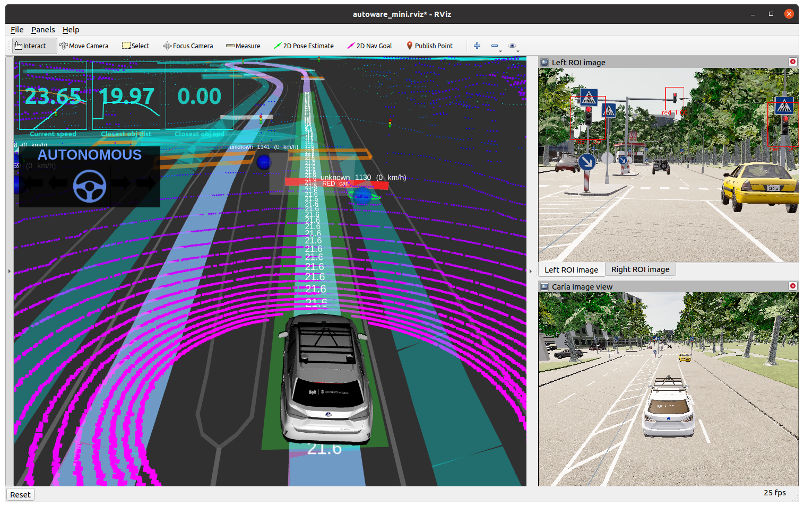

[< Previous practice](../practice_7) -- [**Main Readme**](../README.md)

# Practice 8 - CARLA simulator

Task for this practice is to drive full demo lap with the help of the nodes that you have written during previous practices:
* `localizer`
* `pure_pursuit_follower`
* `lanelet2_global_planner`
* `points_clusterer` and `cluster_detector`
* `simple_local_planner`
* `camera_traffic_light_detector`

You will create a chained workspace with autoware_mini where all the code that are not covered with your nodes is taken from `autoware_mini_ws`. Your nodes will be taken from `autoware_mini_practice` workspace and from package `practice_7`.




## 1. Preparation - create chained workspace

If `autoware_mini_ws` workspace is sourced in the terminal, then building another workspace (in our case `autoware_mini_practice`) will include references to already sourced workspace to a workspace just built and we will get a [chained workspace](https://wiki.ros.org/catkin/Tutorials/workspace_overlaying#Chaining_catkin_workspaces). It means that we can use both workspaces at the same time. That is what we are going to do in this step.

#### Instructions
1. Check if `autoware_mini_ws` worksapce is sourced
    * `echo $CMAKE_PREFIX_PATH` - prints out the value for standard linux environment variable that holds sourced workspace directories
    * `echo $ROS_PACKAGE_PATH` - prints out all the sourced folders for ROS packages
    * Use either one and determine if the `autoware_mini_ws` is sourced
2. If it is not sourced run `source ~/autoware_mini_ws/devel/setup.bash`
3. Go to `autoware_mini_practice` workspace folder and clean, build and source it

    ```
    cd ~/autoware_mini_practice
    catkin clean
    catkin build
    source devel/setup.bash 
    ```

#### Validation
* Verify that both workspaces are available (sourced)
* `echo $CMAKE_PREFIX_PATH` - something similar to the following should be printed out:
    ```
    /home/user/autoware_mini_practice/devel:/home/user/autoware_mini_ws/devel:/opt/ros/noetic
    ```


## 2. Run CARLA simulation

[Launching CARLA simulation](https://gitlab.cs.ut.ee/autonomous-driving-lab/autoware_mini#launch-instructions).

1. Run Carla. 
    ```
    $CARLA_ROOT/CarlaUE4.sh -prefernvidia -quality-level=Low -RenderOffScreen
    ```
2. From `practice_8` launch `start_carla.launch`
    ```
    roslaunch practice_8 start_carla.launch tfl_detector:=camera detector:=lidar_cluster
    ```
3. Drive through the Demo lap
    - [Map of the demo lap](https://adl.cs.ut.ee/lab/demo-track)

4. If you are not able to demonstrate it in person at the practice session, please record the video and send the link.
    - You can use [SimpleScreenRecorder](https://www.geeksforgeeks.org/how-to-install-simplescreenrecorder-ubuntu/)
    - As Carla tends to run very slowly on laptop you can adjust recording framerate to be smaller, like 5Hz (or even less). Then the video won't be so big.